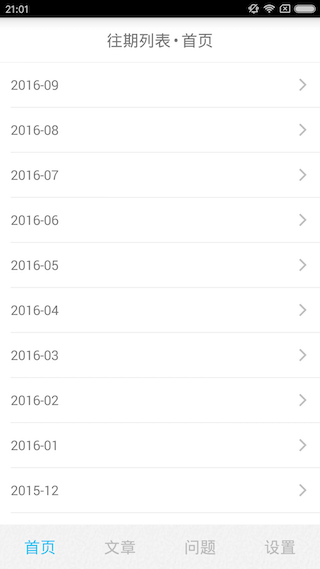

# One
一个·One的非官方版本，旨在做Android技术交流。

## 特点
 * 支持图片缓存到内存和本地。
 * 支持内容缓存到数据库，离线阅读。
 * 使用Databinding框架解耦。
 * 使用Volley，Retrofit网络请求。
 * 支持快速滚动到文章顶部。
 * 支持快速翻回到第一页。
 * 支持向下滑动时全屏阅读。
 * 支持查看历史图片、文章、问题。
 * 支持友盟数据统计。
 * 支持代码混淆, res混淆。

## apk下载地址
[One.apk](./apk/one.apk)

## 界面

